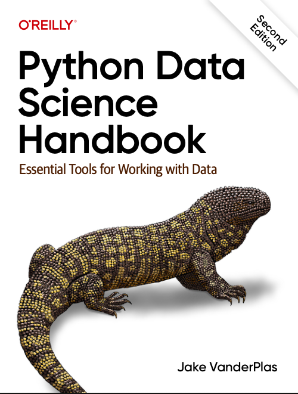

Polynomial Regression Model Selection
This notebook demonstrates how to perform polynomial regression and select the best model degree using validation curves in scikit-learn.

Reference
Examples are inspired by Jake VanderPlas, Python Data Science Handbook: Essential Tools for Working with Data (O'Reilly).

Contents
Generate synthetic data for regression
Fit polynomial regression models of varying degrees
Use validation curves to compare training and validation scores
Select the optimal polynomial degree to avoid overfitting/underfitting
Visualize model performance and fitted curves
How to Use
Run each cell in order to reproduce the analysis.
Modify parameters (like polynomial degree) to experiment with model selection.

Requirements
Python 3.x
scikit-learn
numpy
matplotlib
